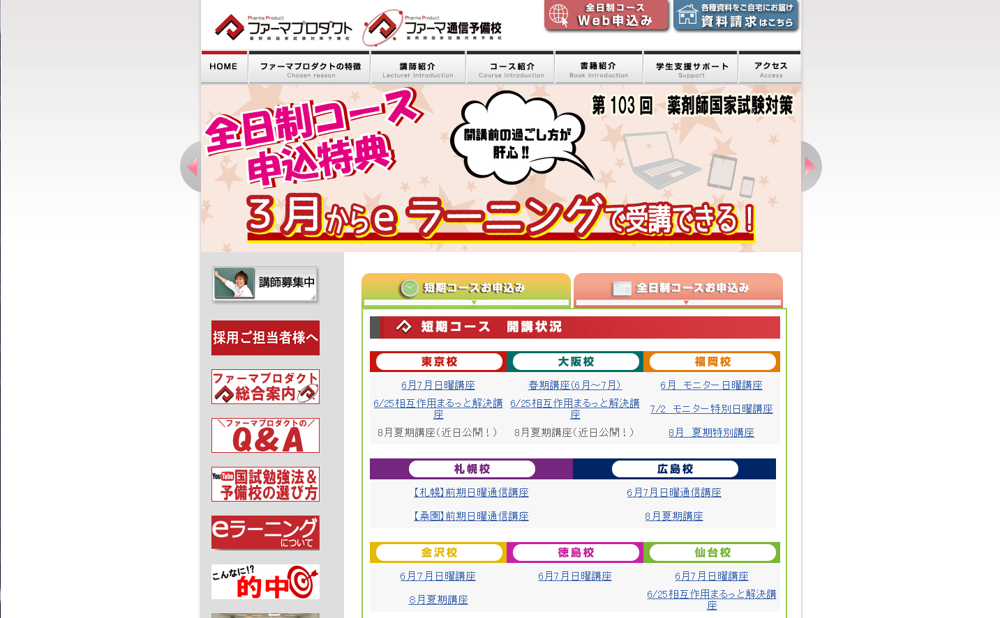
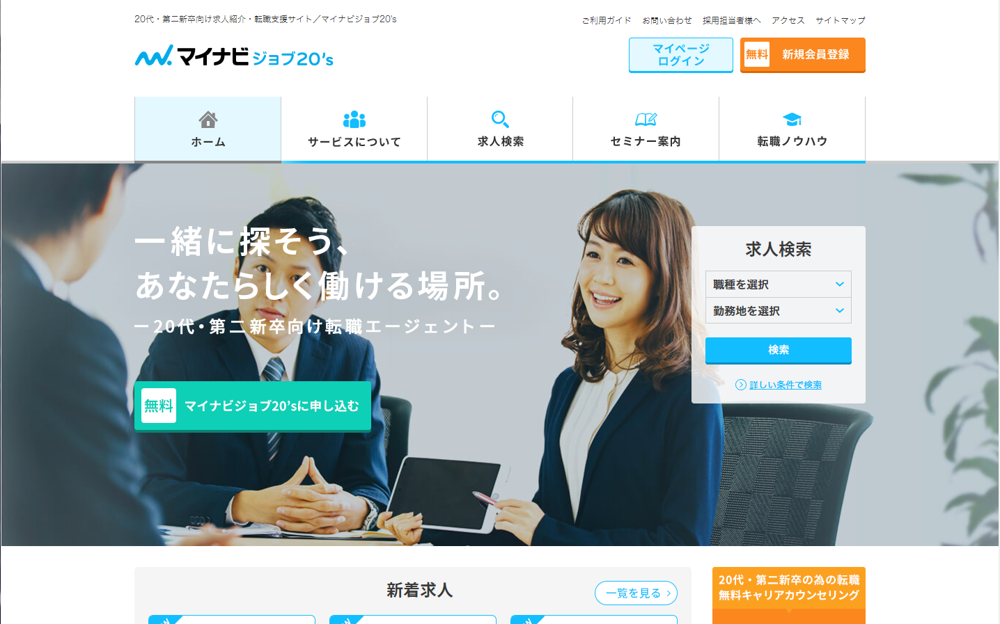
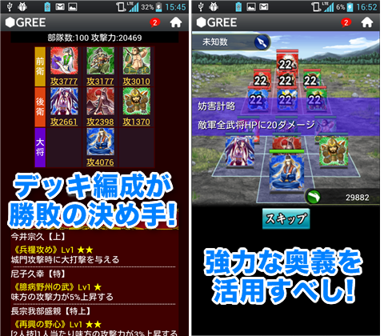
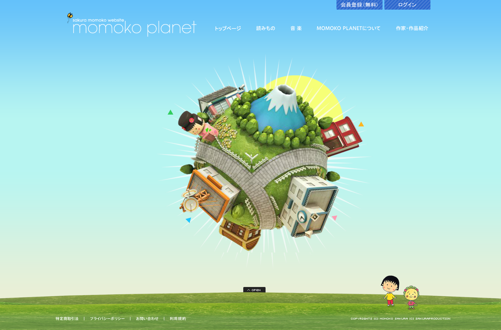

## Profile

---

### 簡単な経歴

- 1978年9月12日生まれ
- 九州の大分県大分市出身
- 2001年福岡大学商学部卒業
- 卒業後、フリーター、新聞社、OA機器営業などを経験
- 2012年から本格的にシステム開発の仕事を開始
- 2013年上京
- 2016年10月末から2017年4月までフィリピンのセブに滞在

---

### 転機

2010年ごろに勤めていたOA機器営業の会社で、ホームページの受注量を上げるため、
簡単なサイトなら外注せずに自社で作成できるようになるかを検討。
独学でHTMLについての勉強を始めたのが開発の仕事に興味を持つようになったきっかけ。
2011年に

---

### ポートフォリオ一部紹介

---

- ファーマプロダクト
- https://pharmaproduct.co.jp/

---

- マイナビjob20s
- https://mynavi-job20s.jp/

---

- 戦国キングダム

---

- 戦国キングダム
- サイト閉鎖済み

---

### 具体的に何をやっていたのか

### おわり
