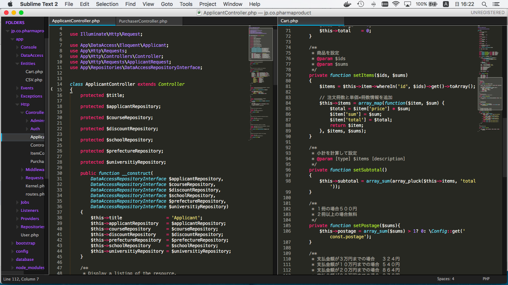
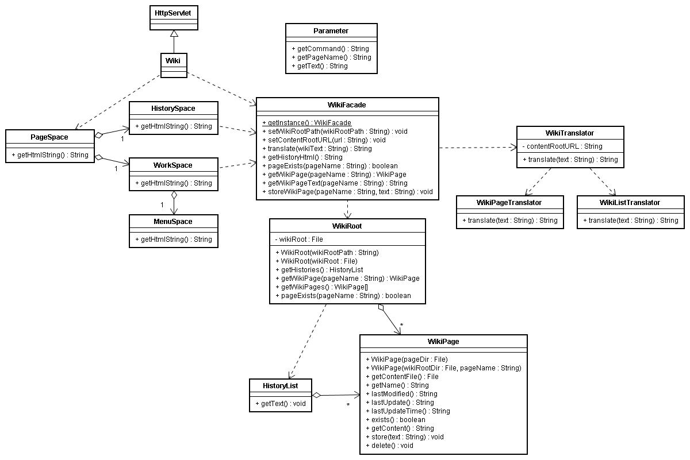
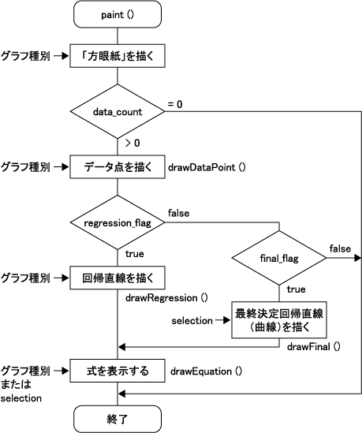
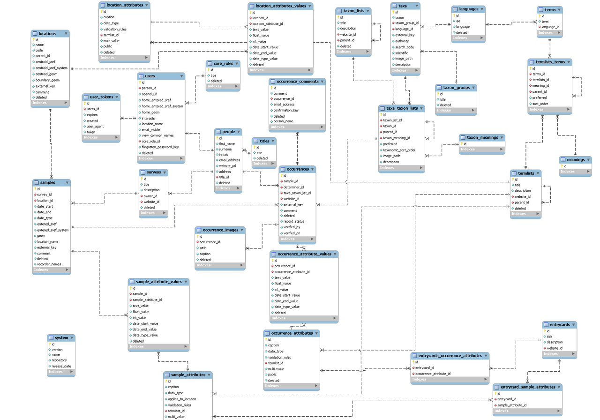
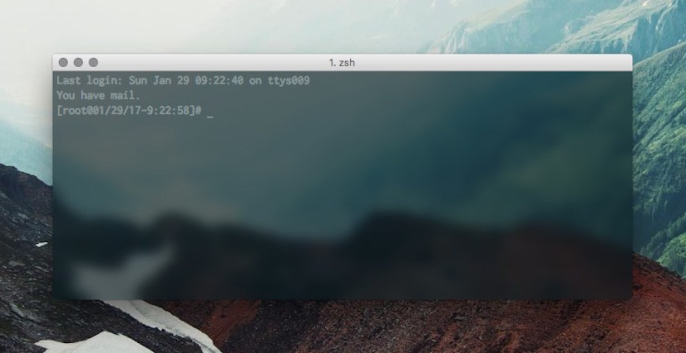
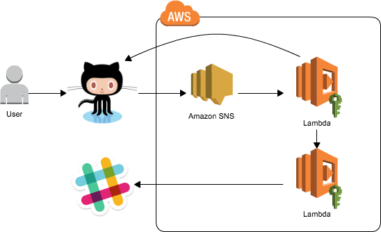

## Profile

---

### Abut me

<table>
  <tr>
    <th colspan="2">那須 毅康(ナス タカヤス)</th>
  </tr>
  <tr>
    <td rowspan="4"></td>
    <td style="font-size : 32px;">Github: TakayasuNasu</td>
  </tr>
  <tr>
    <td style="font-size : 32px;">好きなコマンドは"bundle install"</td>
  </tr>
  <tr>
    <td style="font-size : 32px;">好きなサッカークラブは大分トリニータ</td>
  </tr>
  <tr>
    <td style="font-size : 32px;">好きなJojoのストーリーは第5部"今にも落ちてきそうな空の下で"</td>
  </tr>
</table>

---

### 経歴

- 1978年9月12日生まれ
- 大分県大分市出身
- 2001年福岡大学商学部卒業
- 郵便局、新聞社、出版社、OA機器営業会社に勤務
- 2012年から本格的にシステム開発の仕事を開始
- 2013年4月上京
- 2016年10月末から2017年4月までフィリピンのセブに滞在

---

### 転機

- 2010年ごろOA機器営業の会社で働いていたとき
- OA機器以外にもホームページ制作の営業も行っていた  
↓↓↓
#### 外注に丸投げするので費用だけが高く、受注が難しい状況
- → 自社で作成できないかという話が出る  
- → 独学でHTMLについての勉強を開始  

---

### 制作物

---

---

---

---

---

### 具体的に何をやっていたのか

---

---

---

---

---

---

---

### スキルセット

---

| スキル        | レベル         |
| ------------- | ------------- |
|  | 得意 |
|  | 得意 |
|  | そこそこ |

---

| スキル        | レベル         |
| ------------- | ------------- |
|  | そこそこ |
|  | 得意 |
|  | そこそこ  |

---

### よろしくお願いします
 
